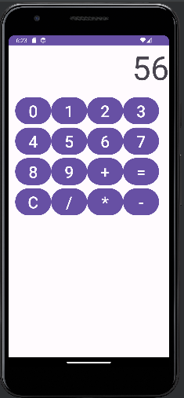

# Calculator App

This is a simple calculator app for Android. It allows you to perform basic arithmetic operations, such as addition, subtraction, multiplication, and division.

## Features

- Addition (+)
- Subtraction (-)
- Multiplication (\*)
- Division (/)
- Clear (C)
- Equals (=)

## Screenshots

